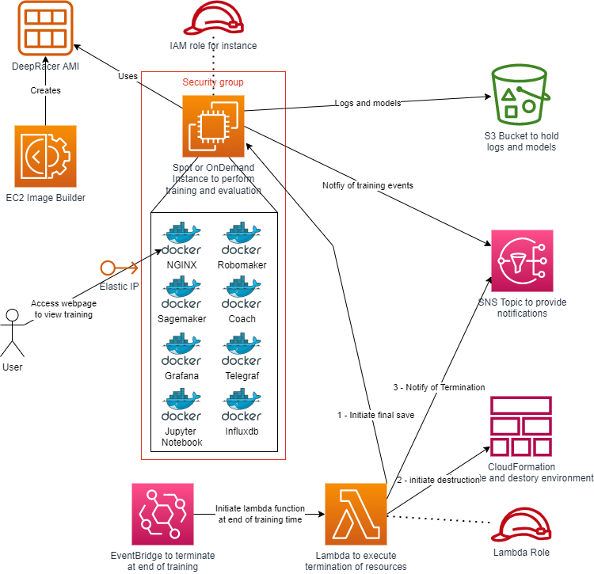
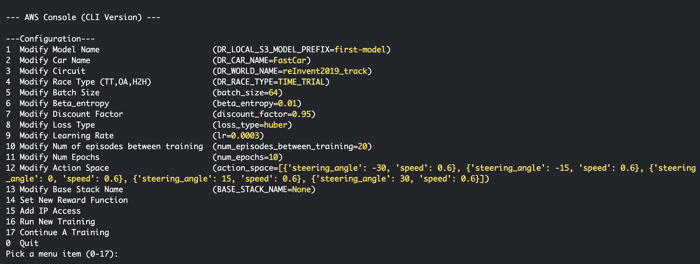

# DeepRacer On The Spot
Simple cloudformation templates to assist in creating ec2 instances for deep racer learning, with automated training start/end and up to 10X savings over training in console (when using ec2 spot instance). This is a wrapper around LarsLL's deepracer-for-cloud https://aws-deepracer-community.github.io/deepracer-for-cloud/ to make it very easy to start training in the AWS Console and take advantage of all amazing tools the deepracer-for-cloud repo gives you. 

Training on an EC2 has many advantages:
<li>Being able to set up a customized action space
<li>Train much faster with up to triple the number of workers on a g4dn.2xl instance
<li>Ability to increment your training
<li>Improved log analysis tools
<li>Train as multiple models at once on different EC2 instances
<li>Reduced cost: $0.22/hour (when using g4dn.2xlarge spot instance, or $0.75/hr when using on demand instance https://aws.amazon.com/ec2/pricing/on-demand/) cost of training versus $3.50/hour on amazon console

## Architectural Overview

The below diagram provides an overview of the architecture of DeepRacer on the Spot: -

## Training Videos
Training videos playlist: https://www.youtube.com/playlist?list=PL9qmHoKq77dTFS59WjHciNb0a0n0dE8iF
* Overview: https://www.youtube.com/watch?v=GP7IZ6X5QPU&list=PL9qmHoKq77dTFS59WjHciNb0a0n0dE8iF
* Setup and first run: https://www.youtube.com/watch?v=b4GHWZcIB18&list=PL9qmHoKq77dTFS59WjHciNb0a0n0dE8iF
* Edit files: https://www.youtube.com/watch?v=EAFR7FSN4Bo&list=PL9qmHoKq77dTFS59WjHciNb0a0n0dE8iF
* Update track: https://www.youtube.com/watch?v=XgdRSAeAzHk&list=PL9qmHoKq77dTFS59WjHciNb0a0n0dE8iF
* Increment training: https://www.youtube.com/watch?v=9y5wx7fQUgc&list=PL9qmHoKq77dTFS59WjHciNb0a0n0dE8iF
* Move model to console: https://www.youtube.com/watch?v=Fk0XCoE8M6U&list=PL9qmHoKq77dTFS59WjHciNb0a0n0dE8iF

## Setup
* Log into AWS console and launch Cloud Shell
* run `git clone https://github.com/aws-deepracer-community/deepracer-on-the-spot`
* run `cd deepracer-on-the-spot`

## Create Base Resources
### create-base-resources.sh

INPUTS:
* stackName - name of base resource stack (example 'base')
* ip - the IP of the machine you are using. This is needed to allowlist your machine's IPv4 to view the agent training and access our menu resources (can be found here https://www.whatismyip.com/)

Example:
`./create-base-resources.sh base 11.111.11.11.1`
**This will run for around 3 minutes.**

The primary purpose of this template is to provide a simple single script to run that sets up all of the prerequisite AWS resources to allow deepracer-for-cloud to run on EC2 instances (https://aws-deepracer-community.github.io/deepracer-for-cloud/). **This should only be ran once per sandbox per region**. This is accomplished by creating the following:
* S3 bucket
* SNS Topic that has messages published to it in the event of spot instance termination to stop training safely and upload model
* EC2 quota limit increases to be able to run 2 x g4dn.2xlarge spot or on demand instances (See FAQs if AWS query the rationale for the quota request)
* Role used to import finished model into the AWS DeepRacer console

This bash script utilizes the base.resources.yaml template file to provision the above resources. Note - if your public IP later changes (e.g. you reboot your router and your ISP changes your IP address) you can re-run this script with the same stack?Name with the updated ip parameter and the stack will just modify the appropriate config.

---
## Create Standard/Spot Instance
### create-standard-instance.sh
### create-spot-instance.sh

INPUTS:
* baseResourcesStackName - stackName from create-base-resource.sh if you ever forget this, you can go to cloudformation and see old stacks
* stackName - name of this stack that will provision an ec2 instance and automatically train deepracer training.  This is also the name used for your model when it's imported into the AWS DeepRacer console, and therefore must conform to that naming convention (Up to 64 characters. Valid characters: A-Z, a-z, 0-9, and hypens (-). No spaces or underscores (_).)
* timeToLiveInMinutes - how long you want this ec2 instance to run for. after X minutes, the instance will be terminated. Default: 60, Min:0, Max: 1440 . If you want the instance to stay alive forever, set this value to 0 (caution: you will be charged per hour the instance is running, and you will need to stop/terminate the instance on your own). You can also increase the max time in standard-instance.yaml or spot-instacnce.yaml if you wish to have a model train more than 24 hours.

Example:
`./create-standard-instance.sh base firstmodelbase 30`
`./create-spot-instance.sh base firstmodelspot 30`
**This will run for around 3 minutes. Viewing the training will starts 5-7 minutes after this completes**

Once this script completes, two links will be printed to console that show the visual training of the model and the log links of the training model I.E. ( 3.87.87.207:8080 and http://3.87.87.207:8100/menu.html respectively ). Paste these into your browser and **wait 5-7 minutes for training to begin**. On the visual training page, the link "/racecar/main_camera/zed/rgb/" will look most similar to the DeepRacer Console.

create-standard-instance.sh creates a single on demand ec2 instance. The instance type used is configured as the default in the standard-instance.yaml cloudformation template file.
create-spot-instance.sh creates an Autoscaling Group comprised of a desired capacity of a single spot ec2 instance if available. This is a fantastic way to save a lot of money on training DeepRacer models, as training on a g4dn.2xl spot instance can get you 4 workers at $0.22/hour (compared to $3.50/hour for 1 worker in console). Note, deployment may fail if there isn't any spot instances of this size available. Procuring a spot instance is most common outside of US work hours.  If training is interrupted by a spot termination, assuming new spot capacity becomes available during your defined training 'timeToLiveInMinutes' a new Spot instance will be created within the autoscaling group and the training will continue from where it terminated.  This will create additional files in your S3 bucket, as subsequent training will either add -1 to your folders or will increment the last number if your name ends with a number for both your training (DR_LOCAL_S3_MODEL_PREFIX) and upload (DR_UPLOAD_S3_PREFIX) locations. If you struggle to get spot capacity you could deploy in another region, but if you do this you need to create an AMI (using scripts/create-image-builder.sh).

This script can be executed many times (the DeepRacer console limits you to training a max of 4 concurrent models), with different instance stack names. All the different instances will share the base resources (efs and s3).  It is strongly recommended if using spot training and you want to run execute this script multiple times concurrently that you define unique locations for where your custom files are stored (DR_LOCAL_S3_CUSTOM_FILES_PREFIX).  This is because the spot interruption handler updated the run.env to be able to continue previous training, failing to alter this could result in overwriting training of one model with the previous progress of a different model being trained concurrently.

Both spot and standard instance requests are launched using a monthly refreshing AMI that is generated in a source AWS account to always grab the newest docker images for robomaker/sagemaker/coach. If you wish to run your own AMI, or run in a region other than us-east-1, use ./create-image-builder.sh to create the monthly refreshing pipeline and update your spot/standard instance bash scripts to use your AMI. NOTE: using your own AMI will incur a charge of ~$1/month because an EC2 instance will be created monthly to update the AMI.

---
### MENU
You can also use the menu.sh to start training, modify config files, and run scripts.

Simply run:
`./menu.sh` or `python3 menu.py`

### OTHER COMMANDS:

### Stopping training

The script stop-training.sh executes 'safe termination' of training by updated the CloudFroamtion stack to gracefully complete the training in 2 minutes time from when the script is ran. This command works for both standard and spot instances. The scripts takes one parameter, the name of the stack used to create the instance (this is the same as the second parameter used to create the instance with either create-standard-instance.sh or create-spot-instance.sh commands). For example: `./stop-instance.sh my-instance-stack-name` . You can also go to cloudformation and manually delete the stack, but if you do that you wont' get graceful termination (i.e. upload of model to DeepRacer Console or S3 upload to your 'upload' bucket)

### Adding additional IP addresses to security group ingress and NACLs

The script add-access.sh checks if the IP address given as parameter does not exist already in the Network ACLs and then, adds an additional IP address to the security group ingress, it also add an NACL entry. Use:  `./add-access.sh <base resources stack name> <stack name> <IP address>`.  This is useful if you have multiple locations where you'd want to monitor your training from.

### Subscribing email addresses to the 'spot instance interruption notification topic' (the topic is created by the base resources stack)

The script add-interruption-notification-subscription.sh adds an email address to the 'interruption notification topic.'
Use: `./add-interruption-notification-subscription.sh <base resources stack name> <stack name> <email address>`

Note, it is also possible to interactively create a subscription on the SNS web console. Adding an email subscription results in an email, with a confirmation link in it, being sent to the email address. Not published message is forwarded to the email prior to the user having confirmed the subscription (by clicking on the link in the original subscription notification email).

## Checking instances on same Sandbox

The script check-instances.sh provides a list showing the recent instances, their current status and PUBLIC_IP. It is an eazy way where users don't need to track/save the PUBLIC_IP after starting each training ( PUBLIC_IP:8100/menu.html ). On the other hand, if the users have executed recently the script stop-training.sh my-instance-stack-name, this my-instance-stack-name instance will be displayed as terminated.

Use. `./check-instances.sh`

## Image Builder

The script create-image-builder.sh creates an EC2 Image Builder Pipeline that creates a new AMI on the 1st of each month. The resources used to create the images include the community git repository content for deep racing. The drivers/containers are installed and the image is rebooted. This speeds up the instance creation, as the software is preinstalled. create-image-builder.sh takes two parameters, the resources stack name and a stack name for the image builder provisioned template. The resources created are defined in the image-builder.yaml template.

Before running this script please ensure you're using the latest version of the [AWS CLI](https://docs.aws.amazon.com/cli/latest/userguide/getting-started-install.html#getting-started-install-instructions), as this is required to unblock public AMI sharing, otherwise you won't be able to use the image that is created for your training.

The image builder pipeline is invoked at mid-night on the 1st of the month. To avoid waiting for the first AMI to be created, the pipeline can be invoked interactively after it has been created by the provisioned template.  Alternatively to avoid the costs of a monthly build (approx $1/region/month where you deploy Image Builder) after deployment you could modify the Image Builder pipeline to run manually in the console, and then trigger it when you want a new build (note - due to Docker cert issues AMIs must be less than 3 months old, otherwise containers don't start, so you should trigger a build at least every 3 months).  Once you are using your own AMIs you must replace the standard AWS Account number (747447086422) in `create-spot-instance.sh` and `create-standard-instance.sh` with your own AWS Account number that hosts the AMIs, otherwise you'll likely get an error as no AMI will be found.

The image builder logs are written into the s3 bucket provided by the 'base resources'. The logs are subject to s3 lifecycle expiration.

Old created AMIs are deleted daily by the Image builder lifecycle policy.

To use cd into scripts directory and run `./create-image-builder.sh <base resources stack name> <stack name>`

## delete-base-resources.sh

This script can be used to delete the resources created by the create-base-resources.sh script (and associated template). Please be aware that the resource deletion will fail if the S3 bucket created is not empty. delete-base-resources.sh takes a single mandatory parameter, the stack-name, same value as above.

## Other useful links:

<li>Track names for DR_WORLD_NAME: https://github.com/aws-deepracer-community/deepracer-race-data/tree/main/raw_data/tracks
<li>Racing types (head to head, time trial, object avoidance) for DR_RACE_TYPE: https://aws-deepracer-community.github.io/deepracer-for-cloud/reference.html
<li>Pull new sagemaker/robomaker docker images: https://github.com/aws-deepracer-community/deepracer-simapp

## FAQ

If you have an issue with training, the best first place to check is CloudFormation "Events" tab to see if there are any errors related to deploying your stack.

| Issue | Description |
| --- | --- |
| The maximum number of network acl entries has been reached | <li>From AWS console, navigate to the VPC service console and select "Your VPCs"</li> <li>Click the ACL in your VPC that was created by your base resources stack </li>  <li>Select the "inbound rules" tab and you may edit the inbound rules to remove 2-3 rules from this section that are higher on the list and end in port 32 with a non-rounded number. This will remove access from some existing IPs.</li> <li>Now run scripts/add-access.sh script from CloudShell to add your IP to this inbound rules list and you should be able to access the instance. </li> <li> Alternatively, you may also just request a higher quota. Navigate to "service quota" service, search for "VPC" -> "ACL" -> "Rules per network ACL" and update from 20 to a larger number such as 40 </li>|
| Exception when checking for DEEPRACER_JOB_TYPE_ENV 'Local' is not valid DeepRacerJobType | <li>This is an error from DRFC and should not affect your training. If you see it in your logs you can ignore it. </li> |
| S3 failed, retry count 1/5: An error occurred (404) when calling the HeadObject operation: Not Found | <li>This is an error from DRFC and should not affect your training. If you see it in your logs you can ignore it. </li> |
| model imported to console says track is reInvent:2018 | <li>This is a bug on AWS side as the import process does not check the track the model was trained on. This is purely a visual issue and does not impact your model. You can continue to train/evaluate on any track you choose. </li> |
| Import model from console to DOTS | <li>From DeepRacer Console, select the model you wish to move to DOTS. In the "Actions" dropdown, select "copy to s3", "create a new bucket", and include the "model" and "logs". Copy the s3 location it will be copied to and hit submit.</li><li>Launch CloudShell and copy this model to your base stack S3 bucket using this command and substitute in your bucket names and model names:  `aws s3 cp "s3://aws-deepracer-assets-b9436ddf-db0a-4f63/my-deepracer-console-model-name/Mon, 17 Jul 2023 17:53:33 GMT/" "s3://my-base-bucket/my-new-model-name" --recursive` </li><li>Your model can now be trained on top of in DOTS by setting the `DR_LOCAL_S3_PRETRAINED_PREFIX` variable to the name of your model. </li> |
| How do I train continuous/SAC instead of discrete action space? | <li>Rename the two example files in custom-files directory "hyperparameters_sac.json" to "hyperparameters.json" and "model_metadata_sac.json" to "model_metadata.json" </li> |
| What if multiple people use the same AWS sandbox? | <li>CloudShell sessions are unique to each user, and each user can clone this repo and create one base-resource stack and as many trainings as they desire. To share models amongst the same account, copy the model from one s3 bucket to the other. </li> |
| Quota increase hasn't been assigned | AWS quota increases are handled by AWS support staff, only the request is programmatic.  It's likely the AWS Support team will respond to your request by asking for further information.  It is recommended you respond with 'I'm utilizing this account to participate in AWS DeepRacer.  In the DeepRacer console training for DeepRacer costs $3.50/hour.  In order to reduce my AWS bill I want to use DeepRacer on the Spot, an AWS DeepRacer community developed solution - https://github.com/aws-deepracer-community/deepracer-on-the-spot, which will allow me to training at up to 1/10th the cost of the console. In order to do this I need access to g4dn spot and on demand instances, as per my request.  Therefore please kindly increase my quota.'.  You may want to preempt the question and add this text to the support ticket straight away, unfortunately the code cannot do this for you as API access to update support tickets is only available to AWS Premium Support customers (which starts at $15k/month).  |
| My model didn't appear in the console after training completed or import failed | <li> This can occasionally happen if the model upload didn't complete before the instance was terminated. Go into the AWS DeepRacer console and import manually following the instructions in the 'Your Models' section after pressing the 'Import Model' button.  You should find your model in the S3 upload folder specified in run.env, or if that process didn't complete you'll find it in the S3 folder specific for training in run.env </li> |
| I want to import into the AWS Console models from when my Spot instance was interrupted | <li> The service is configured to only automatically upload models at the end of training, not at the point of Spot interruption. If you'd like to manually import your model from the point of spot interruption then go into the AWS DeepRacer console and import manually following the instructions in the 'Your Models' section after pressing the 'Import Model' button.  You should find your model in the S3 upload folder specified in run.env, or if that process didn't complete you'll find it in the S3 folder specific for training in run.env </li> |
| My stack doesn't deploy and I get the error 'No export named base-DeepRacerServiceRole found' when trying to start my training | <li> The functionality to automatically add your completed model to the AWS DeepRacer console required an update to the base stack.  Re-run create-base-resources.sh to update your base stack and try again </li> |
| My stack doesn't deploy and I get null AMI error when trying to start my training | <li> You're using a region where there isn't a provided AMI. Use the create-image-builder.sh script in the scripts folder to create an AMI in the region you want to train in </li> |
| I can no longer access my training when it's running | <li> Check the public IP where you're accessing from hasn't changed (e.g. ISP changed IP on reboot), if it's changed updated you access by updating the base resources stack or add access stack </li> |
