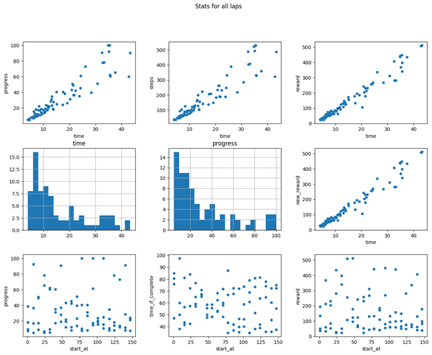
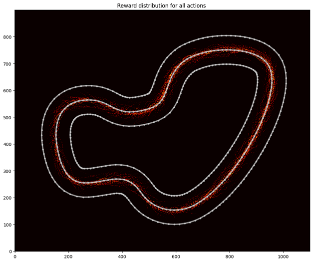

Getting started with training on EC2 instances is fairly straight forward and only requires a few commands run from AWS Cloudshell. Using this tool is recommended for users who have created a few models in the AWS DeepRacer console and want to have more flexibility over their models, the ability to train for a lower price, and learn more about AWS offerings.

# BASIC SETUP

This will create your base resources and should be ran once per account.

| Subject | Details |
| --- | --- |
| Sandbox access and setup | <ul><li> launch the AWS Console and sign into your account </li><li> once your console has loaded, launch AWS CloudShell by using the search bar or hitting this icon on the top ribbon:  </li></ul>  |
| Cloning repo | <ul><li> from CloudShell, clone the repo with this command: `git clone https://github.com/EsaLaine/deepracer-templates/`</li><li> navigate to deepracer-templates directory: `cd deepracer-templates` </li><li> see the files in this directory: `ls`</li> |
| Create base resources | <ul><li>`./create-base-resources.sh <BASE-STACK-NAME> <YOUR-IP>`</li><li>BASE-STACK-NAME : name of this cloudformation stack you are created (i.e. base)</li> <li>YOUR-IP : IPV4 of the machine you are using to access the ec2 instance (https://whatismyip.host) </li> </ul> |
  
## TRAIN FIRST MODEL

| Subject | Details |
| --- | --- |
| Create basic training | <ul><li>`./create-standard-instance.sh <BASE-STACK-NAME> <TRAINING-STACK-NAME> <TIME-TO-LIVE>`</li> <li> BASE-STACK-NAME : same name selected when creating base resources. If you forgot the name, you can check CloudFormation for stacks that have been created before</li> <li>TRAINING-STACK-NAME : name you want this training to be called (i.e. julyprotimetrial)</li> <li>TIME-TO-LIVE : number of minutes to keep the instance running before it is automatically terminated (default 60, min 0, max 1440)</li> </ul> |

CONGRATS! You have trained your first machine learning model on an EC2 instance. After this command finishes, you will see a printout of the EC2 instances IP and port 8080. If you copy this link into your search bar, you will see training start in about 5 minutes and you can see the car moving around the track. Likewise, you will see the EC2's IP and port 8100/menu.html which will have links to useful information like robomaker/sagemaker logs, completed laps, progress, EC2 performance data, and much more. 
You should also be able to navigate to the AWS Console > EC2 > Instances and see your instance running there. This will be terminated after TIME-TO-LIVE minutes. Once you can see the car training, you can terminate this instance and start customizing training parameters.

## CUSTOMIZE TRAINING

| Subject | Details |
| --- | --- |
| Update custom files | The repo we cloned has a sub directory called custom-files which has configuration files that are used to customize your training. You will need to update these files to match the training you want to perform. <ul> From the deepracer-templates directory in CloudShell, navigate to custom-files: `cd custom-files` in this directory, all the files you edit will be uploaded to the EC2 instance prior to training to set up your configuration. <li>hyperparameters.json : defines hyperparameters you can adjust for training your model such as learning rate, batch size, epochs, etc.</li> <li>model_metadata.json : defines model sensors (lidar, dual camera, single camera), action space, training algorithm, and action space type (discrete/continuous)</li> <li>reward_function.py : python reward function you want your model to use in training (https://docs.aws.amazon.com/deepracer/latest/developerguide/deepracer-reward-function-input.html)</li> For the following files, please see [Deepracer-for-cloud Reference](https://aws-deepracer-community.github.io/deepracer-for-cloud/reference.html) for documentation on variables used <li>run.env : parameters for this training. Can set race type (time trial, OA, H2H), track, model name, car color, and much much more. If you are training a new model, you will want to change the model's name each time. DR_LOCAL_S3_MODEL_PREFIX=unique-name-for-this-training</li> <li>system.env : parameters for drfc training. You can define sagemaker/robomaker/coach docker image versions to use, number of workers, etc. You can increase the number of workers depending on the track and ec2 instance type you pick</li> note: if you are using SAC algorithm, you should edit hyperparameters_sac.json and model_metadata_sac.json <li> IMPORTANT NOTE - if you are using multiple spot instance training scripts concurrently it's critical you alter the location the files are stored in S3 by amending 'DR_LOCAL_S3_CUSTOM_FILES_PREFIX' in run.env.  Failure to do this may result in your models overwriting each other, e.g. if 2 models run concurrently model1 could get interrupted and then restart with incremental training on top of model2 </ul> |
| Viewing model training on track | Once EC2 instance is created, in cloud shell console your EC2 instance public IP address is printed which can be used to view your model's training video. Paste the instance's ip, port 8080 into your browser and wait 5-8 minutes after running "create-...-instance.sh" to see the car training on the track <li>http://125.125.125.125:8080 <li>To reduce costs of watching the stream of you car, you can specify the quality and size of the window at the end of the url: <li>http://125.125.125.125:8080/stream_viewer?topic=/racecar/deepracer/kvs_stream&quality=10&width=400&height=300 |
| Monitoring training metrics | Navigate to the `<EC2-INSTANCE-IP>:8100/menu.html` and select Output to see an overview of the current training. |
| Accessing logs for log analysis | Navigate to the `<EC2-INSTANCE-IP>:8100/menu.html` and click robomaker1.log and the logs will be downloaded. You can upload these into the Guru Log Analysis tool https://github.com/aws-deepracer-community/deepracer-log-guru |
| Stopping training | From AWS Console navigate to EC2 service > Instances > select your instance > instance state > terminate. Spot instances cannot be stopped, only terminated from AWS console. |
| Uploading model to console | <li>Navigate to the S3 service > select the bucket that was created in your base resources stack (can navigate to CloudFormation > base stack > Resources > Bucket) and locate the name of the model you ran. Open the upload directory, and hit "copy S3 URI".<li>Navigate to DeepRacer console > your models > import model > paste the S3 URI and name your model ( For example, first box is "s3://tyler-bucket/upload/" and second box is "tyler-model-1" )<li>You can now submit this model to races or evaluate in console |
| Increment training/cloning model | go to custom-files/run.env and change the following variables:<li>DR_LOCAL_S3_MODEL_PREFIX = name of the new model you want to train<li>DR_LOCAL_S3_PRETRAINED = True<li>DR_LOCAL_S3_PRETRAINED_PREFIX = name of the model you want to clone or train on top of |
| Adding new IP to base resources stack | cd to scripts and run `./add-access.sh BASE-STACK-NAME ACCESS-STACK-NAME IP-TO-ADD`<li>BASE-STACK-NAME : same name you selected in the previous section. If you forgot the name, you can check in CloudFormation for stacks that have been created before<li>ACCESS-STACK-NAME : the name of this cloudformation stack (recommended to be "your name-access". i.e. "tyler-access")<li>IP-TO-ADD : IPV4 of the machine you are adding to be able to access the ec2 instance (https://whatismyip.host/). NOT the same IP as create-base-resources.sh. |
| Adding email to SNS topic for notifications | cd to scripts and run `./add-interruption-notification-subscription.sh BASE-STACK-NAME INTERRUPTION-STACK-NAME EMAIL-TO-ADD` <li>BASE-STACK-NAME : same name you selected in the previous section. If you forgot the name, you can check in CloudFormation for stacks that have been created before<li>INTERRUPTION-STACK-NAME : the name of this cloudformation stack (recommended to be "your name-interruption-subscription". i.e. "tyler-interruption-subscription")<li>EMAIL-TO-ADD : email address to subscribe to the SNS topic for notification. |
| Connecting to EC2 instance | Navigate to AWS Console > EC2 > Instances > select your instance > Connect on top bar > Session Manager > Connect |
  
## ANALYSIS DURING TRAINING

| Subject | Details |
| --- | --- |
| Standard web based analysis | Once training progresses to 20-30 minutes you will be able to access standard training analysis via the links from the menu.html page.  These pages include graphs of training progress, reward heatmap and the path taken for your best completed laps, along with tables of highest reward, quickest laps etc.  Here are two examples: -     |
| Ad-hoc analysis | A link is provided to the Jupyter notebook running on the Deep Racer analysis container should you wish to customize your analysis during training.  It is recommended to review the 'import_from_s3' Jupyter notebook so you can see how to read the training data directly from S3, or alternatively review the Training_progress notebook so you can see how simulation_agg, df, track and complete_ones that have been exported can be used via the '%store -r' command |